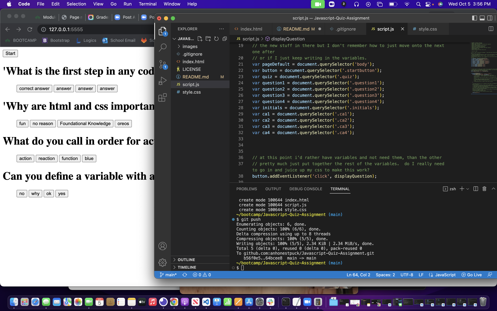

# JavaScript Quiz Project

## Table of Contents
- [Description](#Description)
- [Usage](#Usage)
- [Walkthrough](#Walkthrough)
- [Screenshot](#Screenshot)
- [License](#License)
- [Languages](#Languages)
- [Questions](#Questions)

## Description
quiz application!!

## Usage
To demonstrate functionality of JavaScript

## Screenshot

-------

## License
MIT 

## Languages
JavaScript, node.js, and sequelize, as well as ORM organization of models and classes

## Questions
Email me at pjeffrey40@gmail.com with any concerns or suggestions.